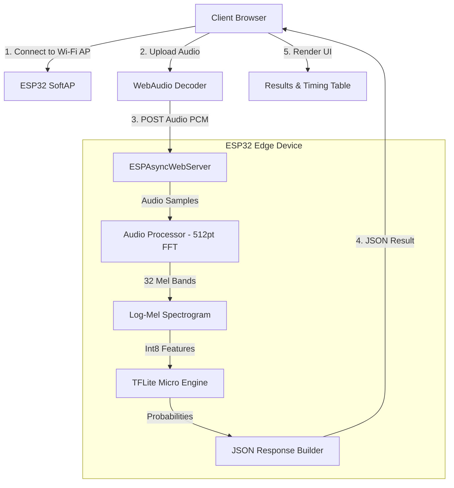

# 🎙️ TinyML Audio Classifier on ESP32 / ESP32-S3

[](https://www.espressif.com/)
[](https://www.tensorflow.org/lite/microcontrollers)
[]()
[]()
[]()

An end-to-end, ultra-low-latency **Edge AI Audio Classification System** running entirely on **ESP32 / ESP32-S3** microcontrollers. The system features an on-device Wi-Fi Access Point, an embedded asynchronous REST web server, real-time Mel-spectrogram feature extraction, and an INT8-quantized Deep Convolutional Neural Network (CNN) powered by **TensorFlow Lite Micro**.

---

## 📸 Screenshots & Demo

> *Place your UI screenshots into the `docs/screenshots/` folder with the filenames below.*

### 🖥️ Web UI Dashboard & Waveform Preview

*Figure 1: Responsive Web UI running directly from the ESP32 with audio drag-and-drop, client-side WebAudio decoding, and waveform rendering.*

---

### ⏱️ Classification Results & Detailed Timing Benchmarks

*Figure 2: Real-time prediction with class confidence bar charts and microsecond-level timing breakdown table matching device and browser latency.*

---

## ✨ Key Features

- **⚡ 100% On-Device Inference**: No cloud dependencies or internet connection required. Runs locally on ESP32 / ESP32-S3.
- **🎯 5 Target Audio Classes**:
  - 🐕 **Dog Barking** (`dog` - Animals)
  - 🐱 **Cat Meowing** (`cat` - Animals)
  - 🌧️ **Rain Sound** (`rain` - Nature)
  - 👏 **Hand Clapping** (`clapping` - Human)
  - 🗣️ **Coughing** (`coughing` - Human)
- **🧠 Ultra-Lightweight INT8 Quantized CNN**:
  - Model Architecture: Depthwise Separable 2D Convolutional Neural Network (MobileNet-style).
  - Flash Footprint: **~17.9 KB** (INT8 flatbuffer).
  - Accuracy: **82.9% test accuracy** on ESC-50 dataset.
- **⚡ Ultra-Low Latency DSP Pipeline**:
  - Preprocessing (512-point FFT + 32-band Mel filterbank): **~15–20 ms**.
  - TFLite Micro Model Inference: **~6–10 ms**.
  - Total Device Latency: **< 30 ms**.
- **🌐 Standalone Wi-Fi Access Point & Web UI**:
  - Automatically launches an Access Point (`TinyML-AudioClassifier`, Password: `12345678`).
  - Embedded asynchronous web server (`ESPAsyncWebServer`) serving a modern responsive web dashboard.
  - Browser-side WebAudio API resampling and decoding supporting `.wav`, `.mp3`, `.m4a`, and `.aac` audio files.
- **📊 Granular Timing Benchmark Tables**:
  - Breaks down latency across WAV parsing, client resampling, audio upload, Mel extraction, and model inference.

---

## 🏗️ System Architecture



---

## 📂 Project Structure

```text
tiny/
├── README.md                                  # Complete project documentation
├── docs/
│   └── screenshots/                           # UI and hardware screenshot placeholders
│       ├── web_ui_dashboard.png
│       └── classification_results.png
└── TinyML_AudioClassifier/                    # Modular ESP32 Arduino sketch
    ├── TinyML_AudioClassifier.ino             # Main entry point (setup and loop)
    ├── audio_processor.cpp / .h               # FFT and 32-band Mel filterbank DSP
    ├── ml_inference.cpp / .h                  # TFLite Micro interpreter and inference
    ├── web_server.cpp / .h                    # Async web server and streaming REST API
    ├── wifi_ap.cpp / .h                       # Wi-Fi SoftAP configuration
    ├── class_labels.h                         # 5-class target labels and categories
    ├── model_data.h                           # Quantized TFLite model flatbuffer array
    └── index_html.h                           # Embedded responsive Web UI in PROGMEM
```

---

## 🛠️ Hardware & Software Requirements

### Hardware
- **Microcontroller**: Any **ESP32** or **ESP32-S3** development board (e.g. ESP32-S3-DevKitC-1, NodeMCU-32S, ESP32 WROOM / WROVER).
- **USB Cable**: Micro-USB or Type-C for flashing and serial monitoring.
- **Memory**:
  - Flash: Minimum 4MB (Default partition scheme).
  - RAM: Internal SRAM (320 KB+) or PSRAM (Buffers and tensor arena dynamically allocate with automatic PSRAM fallback).

### Arduino Libraries
Install the following libraries via the Arduino IDE Library Manager:
1. **`TensorFlowLite_ESP32`** (by Tanmoy Ghosh / TensorFlow Authors)
2. **`ESPAsyncWebServer`** (by me-no-dev / lacamera)
3. **`AsyncTCP`** (by me-no-dev)
4. **`arduinoFFT`** (by Enrique Condes, version 2.0+)

---

## 🚀 Getting Started

### 1. Arduino IDE Setup

1. **Install ESP32 Board Package**:
   - In Arduino IDE, go to **File > Preferences**.
   - Add the following URL to *Additional Boards Manager URLs*:
     ```text
     https://raw.githubusercontent.com/espressif/arduino-esp32/gh-pages/package_esp32_index.json
     ```
   - Open **Tools > Board > Boards Manager**, search for `esp32` by **Espressif Systems**, and click **Install**.

2. **Open the Sketch**:
   - Open [`TinyML_AudioClassifier/TinyML_AudioClassifier.ino`](TinyML_AudioClassifier/TinyML_AudioClassifier.ino) in Arduino IDE.

3. **Configure Board Options**:
   - **Board**: `ESP32-S3 Dev Module` (or your specific ESP32 board).
   - **USB CDC On Boot**: `Enabled` (Crucial for ESP32-S3 Serial Monitor output).
   - **Flash Size**: `4MB` or `8MB`.
   - **Partition Scheme**: `Default 4MB with spiffs (1.2MB APP / 1.5MB SPIFFS)` or `Huge APP (3MB No OTA)`.
   - **Upload Speed**: `921600` (or `115200`).

4. **Upload**:
   - Connect your ESP32 board via USB.
   - Select the corresponding COM port in **Tools > Port**.
   - Click the **Upload** button.

---

### 2. Connecting and Classifying Audio

1. Once uploaded, open the **Serial Monitor** at **115200 baud** to see system initialization:
   ```text
   ========================================
          TinyML Audio Classifier          
   ========================================
   Chip Model: ESP32-S3 (Rev 0)
   CPU Frequency: 240 MHz
   Initial Free Heap: 284120 bytes
   [Wi-Fi] Starting Access Point...
   [Wi-Fi] Access Point Started Successfully!
     SSID:     TinyML-AudioClassifier
     Password: 12345678
     Web UI:   http://192.168.4.1/
   
   Setting up ML Model...
   Model input shape: 1 32 32 1 
   Model output shape: 1 5 
   Arena used: 24520 bytes
   Web server started
   ========================================
   Ready! Connect to Wi-Fi AP & open browser
   ========================================
   ```

2. **Connect to Wi-Fi**:
   - On your smartphone, tablet, or laptop, scan for Wi-Fi networks.
   - Connect to:
     - **SSID**: `TinyML-AudioClassifier`
     - **Password**: `12345678`

3. **Open the Web UI**:
   - Open your web browser (Chrome, Safari, Edge, Firefox) and navigate to:
     ```text
     http://192.168.4.1/
     ```

4. **Classify Audio**:
   - Drag & drop or browse for an audio sample (`.wav`, `.mp3`, `.m4a`) of a dog, cat, rain, clapping, or coughing.
   - The in-browser audio engine will decode and display the waveform.
   - Click **Run Classification** to see instantaneous predictions and the execution benchmark table!

---

## 📊 Performance Benchmarks

| Metric / Pipeline Step | Measured Duration / Size | Notes |
| :--- | :--- | :--- |
| **Model Footprint** | `17.91 KB` | INT8 Quantized FlatBuffer |
| **Tensor Arena RAM** | `24.52 KB` | Dynamic runtime tensor memory |
| **WAV Audio Window** | `1.000 s` (16,000 samples) | 16 kHz 16-bit PCM Mono |
| **Mel Spectrogram Size** | `32 frames × 32 mel bins` | 512-pt FFT, 500-sample hop |
| **1. File Upload (Wi-Fi HTTP)** | `~0.015 – 0.035 s` | Wi-Fi softAP transfer speed |
| **2. WAV Header Parsing** | `0.001 s` | Device-side memory offset |
| **3. Client-side Resampling** | `~0.005 – 0.012 s` | WebAudio OfflineAudioContext |
| **4. Mel Spectrogram Extraction** | `~0.016 – 0.021 s` | Hanning window + 32-step FFT |
| **5. TFLite Model Inference** | `~0.007 – 0.009 s` | INT8 MobileNet-style 2D CNN |
| **Total Device Latency** | **`~0.025 – 0.030 s`** | DSP + Inference on ESP32 |
| **End-to-End Latency** | **`~0.045 – 0.075 s`** | Upload + Inference + Render |

---

## 🧠 Model Training & Export Pipeline

If you wish to retrain or fine-tune the model with custom audio datasets:

1. **Navigate to `model_training/`**:
   ```bash
   cd model_training
   ```

2. **Install Python Dependencies**:
   ```bash
   pip install tensorflow librosa numpy scipy matplotlib soundfile
   ```

3. **Run Training**:
   ```bash
   python train_model.py
   ```
   The script will:
   - Load and extract 5 target classes from the ESC-50 dataset.
   - Apply audio data augmentation (sliding window stride, pitch shifting, time stretch, noise injection, and SpecAugment).
   - Train a Depthwise Separable 2D Convolutional Neural Network.
   - Perform post-training integer quantization (INT8) with a representative calibration dataset.
   - Automatically export the C byte array header to `arduino_firmware/TinyML_AudioClassifier/model_data.h`.

---

## ❓ Troubleshooting

| Issue | Cause | Solution |
| :--- | :--- | :--- |
| **`fatal error: ... No such file or directory`** | Missing library in Arduino IDE | Ensure `TensorFlowLite_ESP32`, `ESPAsyncWebServer`, `AsyncTCP`, and `arduinoFFT` are installed in your Arduino libraries folder. |
| **No output in Serial Monitor (ESP32-S3)** | USB CDC Disabled | Set `Tools > USB CDC On Boot: Enabled` in Arduino IDE. |
| **Wi-Fi AP password incorrect** | Password length mismatch | WPA2-PSK requires at least 8 characters. Default is `12345678`. |
| **Browser cannot open `192.168.4.1`** | Mobile cellular data interference | On smartphones, temporarily disable mobile data while connected to the `TinyML-AudioClassifier` Wi-Fi AP. |
| **Classification always predicts Unknown / Low confidence** | Low amplitude or silent audio | Ensure the uploaded audio has clear sound within the 1.0s window. |

---

## 📜 License

This project is open-source under the [MIT License](LICENSE).
